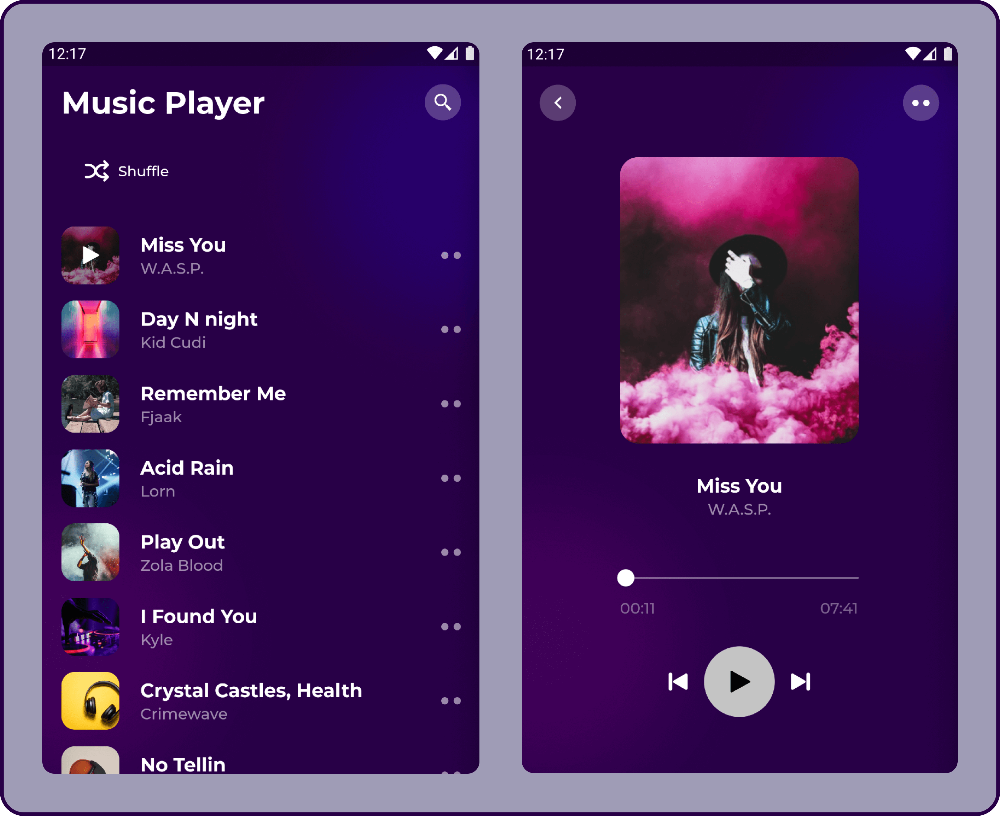

# Simple Flutter Music Player

An Open-Source Simple asset music player built with flutter. It uses the GetX plugin for state managements.

[](https://flutter.dev/)
[](https://pub.dev/packages/get/)
[](https://pub.dev/packages/effective_dart)

<!--  -->


* Note - This project has an audio player plugin which can be used in any of your projects. Check the below link.

### just_audio Audio Player Plugin

[Plugin](https://github.com/ryanheise/just_audio)

## License
```
Copyright © 2022 Amin Enzo
Simple Flutter Music Player is a free software licensed under GPL v3.0
It is distributed in the hope that it will be useful, but WITHOUT ANY WARRANTY;
without even the implied warranty of MERCHANTABILITY or FITNESS FOR A PARTICULAR PURPOSE.
```
See the [GNU General Public License](https://github.com/Sangwan5688/BlackHole/blob/main/LICENSE) for more details.

## Building from Source

1. If you don't have Flutter SDK installed, please visit official [Flutter](https://flutter.dev/) site.
2. Fetch latest source code from master branch.

```
git clone https://github.com/Sangwan5688/BlackHole.git
```

3. Run the app with Android Studio or VS Code. Or the command line:

```
flutter pub get
flutter run
```

## Contribute

All Contributions are welcome.

Special thanks to [Rabia Israr](https://www.figma.com/@rabiaisrar) for this amazing free [UI](https://www.figma.com/community/file/1069634167713119785).

